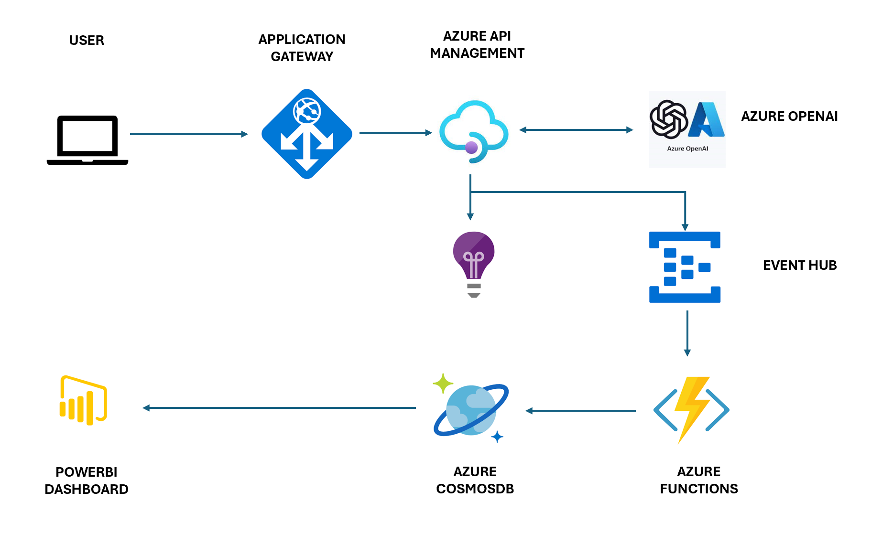

# Enhancing OpenAI Usage Transparency and Billing Accuracy with Azure Open AI and Azure API Management Integration

In today's digital landscape, organizations are increasingly relying on AI-powered services like Azure Open AI (AOAI) to enhance customer interactions and streamline operations. However, gaining granular insights into how these services are being used is crucial for both monitoring and cost allocation. Our solution combines various Azure services to address this need, ensuring that API calls to AOAI pass through the Azure API Management (APIM) gateway. This architecture captures critical details such as user interactions, token consumption, and response data. These insights not only enable effective monitoring but also facilitate internal billing processes. Let's explore the key components of this solution.

Solution Components:

Azure API Management (APIM):
Role: Serves as the entry point for API calls to Azure Open AI.
Function: Captures metadata about each API request, including user details and usage statistics, enabling comprehensive monitoring.

Azure Open AI (AOAI):
Role: The core AI service providing capabilities for language understanding and generation.
Function: Processes user prompts, generating responses that are tracked by APIM for usage analysis.

Azure Event Hub:
Role: Acts as a real-time data ingestion service.
Function: Collects and stores data generated by APIM for later analysis and reporting.

Azure Application Insights:
Role: A monitoring and diagnostics service.
Function: Provides insights into the performance and usage of the APIM gateway, helping to identify issues and optimize operations.

Azure Functions:
Role: Serverless compute for event-driven tasks.
Function: May be used to trigger custom actions based on the data captured by APIM or Event Hub, such as notifications or additional processing.

Azure Cosmos DB:
Role: Globally distributed, multi-model database service.
Function: Could store long-term analytics data and reports, making it easily accessible for billing or auditing purposes.

Power BI:
Role: A powerful business analytics tool.
Function: Connects to Cosmos DB to visualize and report on usage and billing data, making it accessible to stakeholders for informed decision-making.

By integrating these components, our solution not only offers the transparency needed to monitor and optimize the usage of AI services but also provides a comprehensive framework for accurate internal billing. This is a crucial step in promoting responsible and cost-effective AI adoption within the enterprise.

